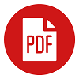

<!-- PROJECT INTRO AND SHIELDS -->
 

  

<h1 align="center">PDFKeeper</h1>
<h3 align="center">Open Source PDF Document Management</h3>
  
  

    
[![Downloads][downloads-shield]][downloads-url]
[![Commit Activity][commit-activity-shield]][commit-activity-url]
[![Donate-PayPal][Donate-PayPal-shield]][Donate-PayPal-url]
     
     
    <a href="https://github.com/rffrasca/pdfkeeper/issues">Report Bug</a>
    ·
    <a href="https://github.com/rffrasca/pdfkeeper/issues">Request Feature/Enhancement</a>
    ·
    <a href="https://github.com/rffrasca/pdfkeeper/issues">Request Compatible Database</a>
    ·
    <a href="https://github.com/rffrasca/PDFKeeper/discussions">Forum</a>
  

<!-- TABLE OF CONTENTS -->

  
Table of Contents

  <ol>
    <li>
      <a href="#about-the-project">About The Project</a>
      <ul>
        <li><a href="#description">Description</a></li>
        <li><a href="#features">Features</a></li>
        <li><a href="#release-history">Release History</a></li>
     </ul>
    </li>
    <li>
      <a href="#getting-started">Getting Started</a>
      <ul>
        <li><a href="#installation">Installation</a></li>
        <li><a href="#building-from-source">Building from Source</a></li>
      </ul>
    </li>
    <li><a href="#license">License</a></li>
    <li><a href="#contact">Contact</a></li>
    <li><a href="#acknowledgments">Acknowledgments</a></li>
  </ol>

<!-- ABOUT THE PROJECT -->
## About The Project

### Description
PDFKeeper is free, open source software that provides a storage and management solution for PDF documents.

![Product Name Screen Shot][product-screenshot]

User Interface in version 11.2.0 and higher.

### Features
* Store and manage PDF documents in a single-user or compatible, multi-user (on-premises or cloud) database where they’re indexed to provide full-text search functionality.
* Upload PDF documents individually or in bulk. In addition, Upload Profile folders can be setup to allow for integration and automation.
* Apply a Title, Author, Subject, Category, and Tax Year to selected documents and when PDF documents are uploaded. In addition, Keywords can be applied when PDF documents are uploaded.
* Set flag state on a selected document and when PDF documents are uploaded to mark for follow-up.
* Add notes to a selected document that can include the date, time, and user account name. All notes can be edited and are indexed by the database.
* Find documents by Search Term, Selections (Author, Subject, Category, and/or Tax Year), or Date Added. In addition, Flagged Documents or All Documents can be listed.
* With PDFKeeper, the following functions can be performed on a selected document: PDF viewing with the bundled or default viewer; PDF bursting; PDF attachments and embedded files extraction; PDF copying to the Clipboard and Drag and Drop to other applications; Flag Document state management; Notes viewing and editing; Keywords, PDF preview, PDF Text, and Search Term Snippets (when applicable) are also displayed for viewing.
* Export selected PDF documents with their category, tax year, notes, and flag state from the database for easy importing.

These features are available in version 11.3.0.

### Release History
Full release history is available in the [Changelog](https://github.com/rffrasca/PDFKeeper/blob/master/docs/Changelog.md).

(<a href="#readme-top">back to top</a>)

<!-- GETTING STARTED -->
## Getting Started

### Installation

- Client prerequisites and compatible Database Management Systems are listed on the [release page](https://github.com/rffrasca/PDFKeeper/releases/latest).
- Download and install the latest version of PDFKeeper from [here](https://github.com/rffrasca/PDFKeeper/releases/latest) or install using Windows Package Manager (winget install pdfkeeper).
- PDFKeeper is installed per-user.
- Database setup instructions are available in the Help file that can be viewed post-install.

### Building from Source

Build Instructions for v12 (in development) is available [here](https://github.com/rffrasca/PDFKeeper/blob/master/docs/Build-Instructions-v12.md).

Build Instructions for v11 is available [here](https://github.com/rffrasca/PDFKeeper/blob/master/docs/Build-Instructions-v11.md).

Build Instructions for v10 is available [here](https://github.com/rffrasca/PDFKeeper/blob/master/docs/Build-Instructions-v10.md).

(<a href="#readme-top">back to top</a>)

<!-- LICENSE -->
## License

PDFKeeper is distributed under the terms of the [GNU General Public License (GPL) Version 3](https://github.com/robertfrasca/PDFKeeper/blob/master/COPYING).

(<a href="#readme-top">back to top</a>)

<!-- CONTACT -->
## Contact

[Robert F. Frasca](mailto:rffrasca@gmail.com) - Project Owner and Maintainer

(<a href="#readme-top">back to top</a>)

<!-- ACKNOWLEDGMENTS -->
## Acknowledgments

* [Best-README-Template](https://github.com/othneildrew/Best-README-Template)
* [ThirdPartyLibraries](https://github.com/max-ieremenko/ThirdPartyLibraries)
* [Third-Party software](https://github.com/rffrasca/PDFKeeper/blob/master/THIRD-PARTY-NOTICES.txt)

(<a href="#readme-top">back to top</a>)

<!-- MARKDOWN LINKS & IMAGES -->
<!-- https://www.markdownguide.org/basic-syntax/#reference-style-links -->
[downloads-shield]: https://img.shields.io/github/downloads/rffrasca/PDFKeeper/total?style=flat
[downloads-url]: https://github.com/rffrasca/PDFKeeper/releases
[commit-activity-shield]: https://img.shields.io/github/commit-activity/y/rffrasca/PDFKeeper?style=flat
[commit-activity-url]: https://github.com/rffrasca/PDFKeeper
[Donate-PayPal-shield]: https://img.shields.io/badge/Donate-PayPal-green.svg
[Donate-PayPal-url]: https://www.paypal.com/donate/?cmd=_s-xclick&hosted_button_id=JCM6ZMCF6BHHN
[product-screenshot]: https://github.com/rffrasca/pdfkeeper/blob/master/docs/UserInterface-11.2.0.png
